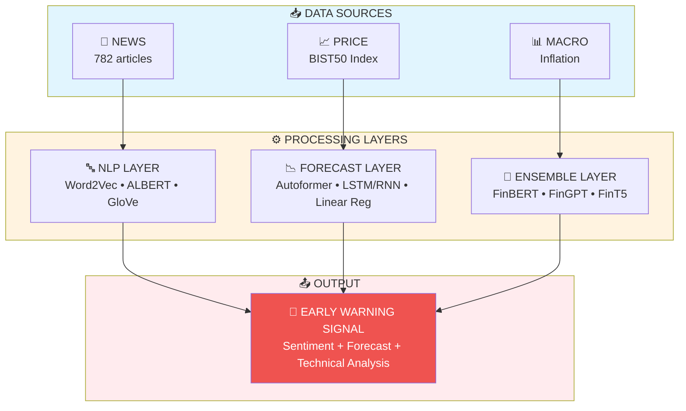

<p align="center">
  
</p>

<h1 align="center">
  🔮 Financial Crisis Prediction
  <br/>
  <sub>NLP • Time Series • Machine Learning • Deep Learning • Transformer TS • Financial LLM</sub>
</h1>

<p align="center">
  
  
  
  
  
</p>

<p align="center">
  <b>📚 PhD Thesis Research</b><br/>
  <i>Early Prediction of Crisis Periods Using Economic Text Data and Market Indicators</i>
</p>

<p align="center">
  <a href="#-key-results">Results</a> •
  <a href="#-models">Models</a> •
  <a href="#%EF%B8%8F-installation">Installation</a> •
  <a href="#-citation">Citation</a>
</p>

---

## 🎯 Overview

> **Research Question:** Can we predict financial crises by combining news sentiment analysis with advanced ML/DL models?

This repository presents a **multi-layered early warning system** for the **2018 Turkish Currency Crisis**, analyzing the BIST50 stock market using **35+ models** across 6 categories.

<div align="center">
<table>
<tr>
<td width="50%">

### 📊 Dataset Summary

| Data | Details |
|:-----|:--------|
| 📰 **News Articles** | 782 Turkish economic news |
| 📈 **Single Stock** | BIST50 Index, 250 days |
| 📊 **Multi-Stock** | 50 stocks × 250 days = 12,500 samples |
| 📅 **Period** | January - December 2018 |

</td>
<td width="50%">

### 🏆 Best Results

| Scenario | Best Model | MAPE |
|:---------|:-----------|-----:|
| 📈 Single Stock (21d) | **Autoformer** | **0.77%** |
| 📊 Multi-Stock (21d) | **FinLLM Ensemble** | **1.84%** |
| 📰 NLP Correlation | **Word2Vec** | **r=0.87** |

</td>
</tr>
</table>
</div>

---

## 📈 Key Results

### 🏅 Model Performance Leaderboard (21-Day Forecast, Single Stock)

<div align="center">

| Rank | Model | RMSE | R² | MAPE | Category |
|:----:|:------|-----:|:--:|-----:|:---------|
| 🥇 | **Autoformer** | **8.54** | **+0.53** | **0.77%** | Transformer TS |
| 🥈 | Linear Regression | 9.36 | +0.43 | 0.85% | Machine Learning |
| 🥉 | Informer | 12.12 | +0.05 | 1.11% | Transformer TS |
| 4 | DeepAR | 12.83 | -0.07 | 1.18% | Transformer TS |
| 5 | FinLLM Ensemble | 13.19 | -0.13 | 1.32% | Financial LLM |
| 6 | AR Fark Alma | 13.35 | -0.16 | 1.10% | Time Series |
| 7 | RNN | 13.54 | -0.19 | 1.24% | Deep Learning |

</div>

### 📊 Performance by Category

<div align="center">

**Single Stock (21-Day) - RMSE by Category:**

| Category | Best Model | RMSE |
|:---------|:-----------|-----:|
| 🏆 Transformer TS | Autoformer | 8.54 |
| Machine Learning | Linear Regression | 9.36 |
| Financial LLM | Ensemble | 13.19 |
| Time Series | AR Fark Alma | 13.35 |
| Deep Learning | RNN | 13.54 |

**Multi-Stock (21-Day) - Best by Category (MAPE %):**

| Category | Best Model | MAPE |
|:---------|:-----------|-----:|
| 🏆 Financial LLM | Ensemble | 1.84% |
| Transformer TS | FEDformer | 3.83% |
| Deep Learning | CNN | 7.10% |
| Machine Learning | Linear Reg | 7.53% |

</div>

### 🔍 NLP Early Warning System

Our **Word2Vec-based sentiment analysis** achieved remarkable predictive power:

<div align="center">

| Model | Lag | Correlation | p-value | Status |
|:------|:---:|:-----------:|:-------:|:------:|
| **Word2Vec** | 3 months | **r = 0.8715** | 0.0022 | 🏆 Best |
| Word2Vec | 2 months | r = 0.8621 | 0.0013 | ✅ |
| ALBERT | 3 months | r = 0.8058 | 0.0087 | ✅ |
| GloVe | 2 months | r = 0.8025 | 0.0052 | ✅ |
| USE | 3 months | r = 0.7443 | 0.0214 | ✅ |
| FastText | 0 months | r = 0.6800 | 0.0150 | ✅ |

</div>

> 💡 **Key Finding:** Word2Vec predicted inflation changes **3 months in advance** with 87% correlation!

---

## 🧠 Models

<div align="center">
<table>
<tr>
<td width="33%" valign="top">

### 📰 NLP Models (7)
| Model | Link |
|:------|:-----|
| BERT | [GitHub](https://github.com/google-research/bert) |
| ALBERT | [GitHub](https://github.com/google-research/albert) |
| RoBERTa | [GitHub](https://github.com/facebookresearch/fairseq) |
| Word2Vec | [GitHub](https://github.com/tmikolov/word2vec) |
| GloVe | [GitHub](https://github.com/stanfordnlp/GloVe) |
| FastText | [GitHub](https://github.com/facebookresearch/fastText) |
| USE | [TF Hub](https://tfhub.dev/google/universal-sentence-encoder/4) |

</td>
<td width="33%" valign="top">

### 📈 Time Series (5+)
| Model | Link |
|:------|:-----|
| AR/MA/ARMA | [statsmodels](https://github.com/statsmodels/statsmodels) |
| ARIMA | [statsmodels](https://github.com/statsmodels/statsmodels) |
| SARIMA | [pmdarima](https://github.com/alkaline-ml/pmdarima) |
| + Variants | |
| └─ Log Transform | |
| └─ Differencing | |
| └─ Smoothing | |

</td>
<td width="33%" valign="top">

### 🤖 Machine Learning (5)
| Model | Link |
|:------|:-----|
| Linear Regression | [sklearn](https://github.com/scikit-learn/scikit-learn) |
| SVM (RBF) | [sklearn](https://github.com/scikit-learn/scikit-learn) |
| Random Forest | [sklearn](https://github.com/scikit-learn/scikit-learn) |
| Decision Tree | [sklearn](https://github.com/scikit-learn/scikit-learn) |
| KNN | [sklearn](https://github.com/scikit-learn/scikit-learn) |

</td>
</tr>
<tr>
<td width="33%" valign="top">

### 🧬 Deep Learning (4)
| Model | Link |
|:------|:-----|
| LSTM | [TensorFlow](https://github.com/tensorflow/tensorflow) |
| RNN | [TensorFlow](https://github.com/tensorflow/tensorflow) |
| CNN | [TensorFlow](https://github.com/tensorflow/tensorflow) |
| MLP | [TensorFlow](https://github.com/tensorflow/tensorflow) |

</td>
<td width="33%" valign="top">

### ⚡ Transformer TS (7)
| Model | Link |
|:------|:-----|
| Autoformer ⭐ | [GitHub](https://github.com/thuml/Autoformer) |
| Informer | [GitHub](https://github.com/zhouhaoyi/Informer2020) |
| FEDformer | [GitHub](https://github.com/MAZiqing/FEDformer) |
| TimesNet | [GitHub](https://github.com/thuml/TimesNet) |
| TFT | [GitHub](https://github.com/google-research/google-research/tree/master/tft) |
| TSMixer | [GitHub](https://github.com/google-research/google-research/tree/master/tsmixer) |
| DeepAR | [GluonTS](https://github.com/awslabs/gluonts) |

</td>
<td width="33%" valign="top">

### 💰 Financial LLMs (3)
| Model | Link |
|:------|:-----|
| FinBERT | [GitHub](https://github.com/ProsusAI/finBERT) |
| FinGPT | [GitHub](https://github.com/AI4Finance-Foundation/FinGPT) |
| FinT5 | [HuggingFace](https://huggingface.co/SALT-NLP/FLANG-T5) |

**Fine-tuned with LoRA:**
| Param | Value |
|:------|:------|
| rank | 8 |
| alpha | 32 |
| epochs | 3 |

</td>
</tr>
</table>
</div>

---

## 📉 Detailed Results

### 🎯 Transformer TS Models (21-Day Forecast, Single Stock)

<div align="center">

| Model | RMSE | MAE | R² | MAPE | Dir. Acc. | Key Feature |
|:------|-----:|----:|:--:|-----:|:---------:|:------------|
| 🥇 **Autoformer** | **8.54** | 6.89 | **+0.53** | 0.77% | 60.0% | Auto-Correlation |
| 🥈 Informer | 12.12 | 9.81 | +0.05 | 1.11% | 43.3% | ProbSparse Attention |
| 🥉 DeepAR | 12.83 | 10.48 | -0.07 | 1.18% | 53.3% | Probabilistic |
| TimesNet | 19.49 | 16.00 | -1.47 | 1.81% | 33.3% | 2D Variation |
| TSMixer | 19.38 | 16.48 | -1.44 | 1.87% | **63.3%** | All-MLP |
| TFT | 48.44 | 47.01 | -14.25 | 5.30% | 36.7% | Multi-horizon |

</div>

### 🧬 Deep Learning Models (21-Day Forecast)

<div align="center">
<table>
<tr>
<th>Model</th>
<th>Single Stock</th>
<th>Multi-Stock</th>
<th>Improvement</th>
</tr>
<tr>
<td><b>RNN</b></td>
<td>13.54 RMSE</td>
<td>0.80 RMSE</td>
<td>

</td>
</tr>
<tr>
<td><b>LSTM</b></td>
<td>20.25 RMSE</td>
<td>0.81 RMSE</td>
<td>

</td>
</tr>
<tr>
<td><b>CNN</b></td>
<td>21.06 RMSE</td>
<td>0.75 RMSE</td>
<td>

</td>
</tr>
<tr>
<td><b>MLP</b></td>
<td>46.07 RMSE</td>
<td>0.85 RMSE</td>
<td>

</td>
</tr>
</table>
</div>

> ⚠️ **Note:** RMSE reduction is due to: (1) Scale difference (index ~1000 pts vs stock prices ~10-100 TL), (2) Data volume increase (250 → 12,500 samples)

### 💰 Financial LLM Ensemble Results

<div align="center">

**Sentiment Scores:**

| Model | Score | Interpretation |
|:------|------:|:---------------|
| FinBERT | -0.087 | 📉 Bearish |
| FinGPT | +0.045 | ➡️ Neutral |
| FinT5 | -0.391 | 📉📉 Very Bearish |
| **Ensemble** | **-0.117** | **📉 Bearish** |

**Forecast Performance vs Naive Baseline:**

| Period | Ensemble RMSE | Naive RMSE | Improvement |
|:------:|:-------------:|:----------:|:-----------:|
| 1-Day | 2.42 | 4.54 | ✅ **47%** |
| 10-Day | 15.72 | 32.87 | ✅ **52%** |
| 21-Day | 13.19 | 36.74 | ✅ **64%** |

</div>

---

## 🏗️ Architecture



---

## 📁 Repository Structure

```
📦 financial-crisis-prediction
├── 📂 notebooks/
│   ├── 📓 0_NLP_Phase1.ipynb           # News collection & preprocessing
│   ├── 📓 0_NLP_Phase2.ipynb           # Sentiment analysis
│   ├── 📓 1_DeepLearning.ipynb         # LSTM, RNN, CNN, MLP
│   ├── 📓 2_TimeSeries_ML.ipynb        # ARIMA, SARIMA, ML
│   ├── 📓 3_AdvancedDL_FinLLM.ipynb    # FinLLM (single stock)
│   ├── 📓 4_AdvancedDL_FinLLM_Full.ipynb # FinLLM (multi-stock)
│   ├── 📓 5_DeepLearning_Full.ipynb    # DL (multi-stock)
│   ├── 📓 6_MachineLearning_Full.ipynb # ML (multi-stock)
│   ├── 📓 7_Transformers.ipynb         # Transformer TS (single)
│   ├── 📓 8_Transformers_Full.ipynb    # Transformer TS (multi)
│   └── 📓 9_NLP_Comparison.ipynb       # NLP benchmarking
├── 📂 data/
│   └── 📄 README.md                    # Data sources
├── 📂 results/
│   └── 📊 Model_Comparison.xlsx        # Detailed results
├── 📄 requirements.txt
├── 📄 LICENSE
└── 📄 README.md
```

---

## ⚙️ Installation

```bash
# Clone the repository
git clone https://github.com/bayramkotan/financial-crisis-prediction-nlp-ts-ml-dl-transformers.git
cd financial-crisis-prediction-nlp-ts-ml-dl-transformers

# Create virtual environment
python -m venv venv
source venv/bin/activate  # Linux/Mac
# venv\Scripts\activate   # Windows

# Install dependencies
pip install -r requirements.txt
```

### 🔧 Requirements

<details>
<summary>📦 Click to expand full requirements</summary>

| Category | Package | Version | Description |
|:---------|:--------|:--------|:------------|
| **Core** | [pandas](https://pandas.pydata.org/) | ≥2.0 | Data manipulation |
| | [numpy](https://numpy.org/) | ≥1.24 | Numerical computing |
| | [scipy](https://scipy.org/) | ≥1.10 | Scientific computing |
| | [matplotlib](https://matplotlib.org/) | ≥3.7 | Visualization |
| | [seaborn](https://seaborn.pydata.org/) | ≥0.12 | Statistical visualization |
| | [openpyxl](https://openpyxl.readthedocs.io/) | ≥3.1 | Excel I/O |
| **ML** | [scikit-learn](https://scikit-learn.org/) | ≥1.3 | Machine learning |
| | [scikeras](https://github.com/adriangb/scikeras) | ≥0.13 | Keras sklearn wrapper |
| **Deep Learning** | [tensorflow](https://tensorflow.org/) | ≥2.15 | Deep learning framework |
| | [keras](https://keras.io/) | ≥2.15 | High-level DL API |
| | [torch](https://pytorch.org/) | ≥2.0 | Deep learning framework |
| | [pytorch-lightning](https://lightning.ai/) | ≥2.0 | PyTorch training |
| **Time Series** | [statsmodels](https://www.statsmodels.org/) | ≥0.14 | Statistical models |
| | [pmdarima](https://alkaline-ml.com/pmdarima/) | ≥2.0 | Auto ARIMA |
| | [neuralforecast](https://nixtla.github.io/neuralforecast/) | ≥1.7 | Neural forecasting |
| **NLP** | [transformers](https://huggingface.co/transformers/) | ≥4.36 | 🤗 Transformers |
| | [sentence-transformers](https://www.sbert.net/) | ≥2.2 | Sentence embeddings |
| | [gensim](https://radimrehurek.com/gensim/) | ≥4.3 | Word2Vec, Doc2Vec |
| | [fasttext](https://fasttext.cc/) | ≥0.9 | Fast text classifier |
| | [nltk](https://www.nltk.org/) | ≥3.8 | NLP toolkit |
| | [tensorflow-hub](https://tfhub.dev/) | ≥0.15 | TF model hub |
| **FinLLM** | [peft](https://github.com/huggingface/peft) | ≥0.7 | Parameter-efficient FT |
| | [accelerate](https://huggingface.co/accelerate) | ≥0.25 | 🤗 Training acceleration |
| | [bitsandbytes](https://github.com/TimDettmers/bitsandbytes) | ≥0.42 | 8-bit optimizers |
| | [datasets](https://huggingface.co/datasets) | ≥2.14 | 🤗 Datasets |
| | [sentencepiece](https://github.com/google/sentencepiece) | ≥0.1 | Tokenization |
| **Data Collection** | [gnews](https://github.com/ranahaani/GNews) | ≥0.3 | Google News API |
| | [newsapi-python](https://newsapi.org/) | ≥0.2 | News API client |
| | [requests](https://requests.readthedocs.io/) | ≥2.31 | HTTP library |
| | [beautifulsoup4](https://www.crummy.com/software/BeautifulSoup/) | ≥4.12 | Web scraping |
| | [deep-translator](https://github.com/nidhaloff/deep-translator) | ≥1.11 | Translation |
| **Utilities** | [tqdm](https://tqdm.github.io/) | ≥4.66 | Progress bars |
| | [inflect](https://github.com/jaraco/inflect) | ≥7.0 | Number to words |

</details>

**Quick Install:**
```bash
pip install pandas>=2.0 numpy>=1.24 scipy>=1.10 matplotlib>=3.7 seaborn>=0.12 scikit-learn>=1.3 tensorflow>=2.15 torch>=2.0 transformers>=4.36 neuralforecast>=1.7 statsmodels>=0.14 gensim>=4.3 peft>=0.7 accelerate>=0.25
```

---

## 🖥️ Development Environment

<div align="center">

| | Component | Details |
|:--:|:----------|:--------|
| ☁️ | **Platform** | Google Colab Pro+ |
| 🎮 | **GPU** | NVIDIA A100 (80GB VRAM) |
| 🧠 | **RAM** | 168 GB System Memory |
| 🐍 | **Python** | 3.10+ |
| 🔥 | **TensorFlow** | 2.15.0 |
| ⚡ | **PyTorch** | 2.1.0 + CUDA 12.1 |
| 🤗 | **Transformers** | 4.36.0 |
| 📈 | **NeuralForecast** | 1.7.0 |

</div>

### 📚 Key Libraries by Category

<div align="center">

| 🔬 ML/DL | 🤗 NLP | 📈 Time Series | 💰 FinLLM | 📊 Data |
|:--------:|:------:|:--------------:|:---------:|:-------:|
| [TensorFlow](https://tensorflow.org/) | [Transformers](https://huggingface.co/transformers/) | [NeuralForecast](https://nixtla.github.io/neuralforecast/) | [PEFT](https://github.com/huggingface/peft) | [Pandas](https://pandas.pydata.org/) |
| [PyTorch](https://pytorch.org/) | [NLTK](https://www.nltk.org/) | [statsmodels](https://www.statsmodels.org/) | [LoRA](https://github.com/microsoft/LoRA) | [NumPy](https://numpy.org/) |
| [Keras](https://keras.io/) | [Gensim](https://radimrehurek.com/gensim/) | [pmdarima](https://alkaline-ml.com/pmdarima/) | [bitsandbytes](https://github.com/TimDettmers/bitsandbytes) | [Matplotlib](https://matplotlib.org/) |
| [scikit-learn](https://scikit-learn.org/) | [FastText](https://fasttext.cc/) | | [Accelerate](https://huggingface.co/accelerate) | [SciPy](https://scipy.org/) |

</div>

---

## 📖 Citation

If you use this code, please cite:

```bibtex
@phdthesis{kotan2026financial,
  title     = {Early Prediction of Crisis Periods Using Economic Text Data 
               and Market Indicators: Comparative Application of Time Series 
               Methods, Customized Transformer Models, and Deep Learning Approaches},
  author    = {Kotan, Bayram},
  year      = {2026},
  school    = {Duzce University},
  type      = {PhD Thesis},
  pages     = {174}
}
```

---

## 📚 Key References

<div align="center">

| Paper | Authors | Year | Contribution |
|:------|:--------|:----:|:-------------|
| Attention Is All You Need | Vaswani et al. | 2017 | Transformer architecture |
| Autoformer | Wu et al. | 2021 | Auto-correlation mechanism |
| Informer | Zhou et al. | 2021 | ProbSparse attention |
| FinBERT | Yang et al. | 2020 | Financial sentiment |
| FinGPT | Yang et al. | 2023 | Open-source financial LLM |

</div>

---

## 👤 Author

<div align="center">
<table>
<tr>
<td width="150">

</td>
<td>

**Bayram Kotan**  
📍 Duzce University, Turkey  
🎓 Department of Electrical-Electronics & Computer Engineering  
🔬 Research: Financial NLP, Time Series, Deep Learning

</td>
</tr>
</table>
</div>

### 🙏 Acknowledgments

- **Advisor:** Assoc. Prof. Dr. Serdar Kırışoğlu
- **Committee:** Prof. Dr. Resul Kara, Prof. Dr. Pakize Erdoğmuş, Prof. Dr. Devrim Akgün, Assoc. Prof. Dr. Murat İskefiyeli
- **Resources:** Google Colab, Hugging Face, NeuralForecast

---

<p align="center">
  
  
</p>

<p align="center">
  ⭐ <b>If you find this research useful, please star the repository!</b> ⭐
</p>

---

<p align="center">
  <sub>© 2026 Bayram Kotan. MIT License.</sub>
</p>
