<p align="center">
  
</p>

<p align="center">
  
</p>

<h1 align="center">
  🔮 Financial Crisis Early Warning System
  <br/>
  <sub>Predicting the 2018 Turkish Currency Crisis using NLP, Machine Learning & Deep Learning</sub>
</h1>

<p align="center">
  
</p>

<p align="center">
  
  
  
  
  
  
</p>

<p align="center">
  <b>📚 PhD Thesis Research | Düzce University (2026)</b><br/>
  <i>"Early Prediction of Crisis Periods Using Economic Text Data and Market Indicators"</i>
</p>

<p align="center">
  <a href="#-about-the-project">About</a> •
  <a href="#-research-motivation">Motivation</a> •
  <a href="#-key-findings">Key Findings</a> •
  <a href="#-models--methods">Models</a> •
  <a href="#-detailed-results">Results</a> •
  <a href="#-installation">Installation</a> •
  <a href="#-citation">Citation</a>
</p>

---

## 📖 About the Project

### The 2018 Turkish Currency Crisis

In August 2018, Turkey experienced one of its most severe currency crises in modern history. The Turkish Lira lost approximately **40% of its value** against the US Dollar within a few months, causing:

- 📉 **Stock Market Volatility:** BIST100 index dropped significantly
- 📈 **Inflation Surge:** Annual inflation exceeded 25%
- 💰 **Economic Uncertainty:** Business confidence plummeted

### Research Question

> **Can we build an early warning system that predicts financial crises by combining news sentiment analysis with advanced forecasting models?**

This thesis presents a **comprehensive multi-model framework** that analyzes:
1. **782 Turkish economic news articles** for sentiment patterns
2. **BIST50 stock price movements** for technical analysis
3. **Macroeconomic indicators** (inflation, interest rates)

### What Makes This Research Unique?

<div align="center">

| Aspect | Description |
|:-------|:------------|
| 🔬 **Comprehensive Comparison** | 35+ models across 6 categories (NLP, Time Series, ML, DL, Transformer, FinLLM) |
| 🇹🇷 **Turkish Financial Market** | First large-scale study on BIST50 with multi-model approach |
| 🔮 **Predictive Power** | Word2Vec achieved **87% correlation** with inflation 3 months ahead |
| 🤖 **State-of-the-Art Models** | Includes latest Transformer architectures (Autoformer, Informer, FEDformer) |
| 💰 **Financial LLMs** | Fine-tuned FinBERT, FinGPT, FinT5 with LoRA for Turkish market |
| 📊 **Dual Scenario Analysis** | Both single-stock (250 samples) and multi-stock (12,500 samples) experiments |

</div>

---

## 🎯 Research Motivation

### Why Predict Financial Crises?

Financial crises cause devastating effects on economies and societies:

```
📉 Market Crashes    →  Investor losses, pension fund devaluations
💼 Business Failures →  Unemployment, supply chain disruptions  
🏠 Social Impact     →  Reduced purchasing power, quality of life decline
🌍 Global Contagion  →  Spillover effects to other economies
```

### The Gap in Literature

<div align="center">

| Challenge | Our Solution |
|:----------|:-------------|
| Most studies focus on developed markets | ✅ Focus on emerging market (Turkey) |
| Single model approaches | ✅ Comprehensive 35+ model comparison |
| Limited NLP integration | ✅ 7 NLP models for sentiment analysis |
| Lack of modern architectures | ✅ State-of-the-art Transformers & FinLLMs |
| Short prediction horizons | ✅ 1-day, 10-day, and 21-day forecasts |

</div>

---

## 🏆 Key Findings

### 🔥 Headline Results

<div align="center">

| Discovery | Details |
|:----------|:--------|
| 🥇 **Best Short-Term** | TimesNet achieved **0.0484% MAPE** for 1-day forecast (single stock) |
| 🥈 **Best Medium-Term** | AR Fark Alma achieved **0.52% MAPE** for 10-day forecast (single stock) |
| 🥉 **Best Long-Term** | Autoformer achieved **0.77% MAPE** for 21-day forecast (single stock) |
| 📰 **NLP Power** | Word2Vec predicted inflation **3 months in advance** with r=0.87 |
| 🤖 **FinLLM Success** | Ensemble achieved **1.41-1.84% MAPE** across all periods (multi-stock) |

</div>

### 📊 Dataset Summary

<div align="center">

| Scenario | Description | Samples | Stocks |
|:---------|:------------|--------:|-------:|
| **Single Stock (Limited Data)** | Single stock prediction | 250 | 1 |
| **Multi-Stock (Large Data)** | Multiple stocks prediction | 12,500 | 50 |

</div>

---

## 📈 Detailed Results

### 🎯 Single Stock Scenario - Best Models by Period (MAPE)

<div align="center">

| Period | Model | Category | MAPE (%) | RMSE | MAE | R² |
|:------:|:------|:---------|:--------:|-----:|----:|:--:|
| **1 Day** | TimesNet | Transformer | **0.0484** | 0.44 | 0.44 | - |
| | Linear Regression | ML | 0.07 | 0.64 | 0.64 | - |
| | RNN | Deep Learning | 0.07 | 0.62 | 0.62 | - |
| **10 Day** | AR Fark Alma | Time Series | **0.52** | 5.99 | 4.66 | -0.07 |
| | Linear Regression | ML | 0.75 | 7.69 | 6.60 | -0.75 |
| | RNN | Deep Learning | 1.10 | 12.22 | 9.69 | -3.43 |
| **21 Day** | Autoformer | Transformer | **0.77** | 8.54 | 6.89 | +0.53 |
| | Linear Regression | ML | 0.85 | 9.36 | 7.54 | +0.43 |
| | AR Fark Alma | Time Series | 1.10 | 13.35 | 9.85 | -0.16 |

</div>

### 📊 Single Stock - Full 21-Day Leaderboard

<div align="center">

| Rank | Model | Category | MAPE (%) | RMSE | R² |
|:----:|:------|:---------|:--------:|-----:|:--:|
| 🥇 | **Autoformer** | Transformer | **0.77** | 8.54 | +0.53 |
| 🥈 | Linear Regression | ML | 0.85 | 9.36 | +0.43 |
| 🥉 | AR Fark Alma | Time Series | 1.10 | 13.35 | -0.16 |
| 4 | Informer | Transformer | 1.11 | 12.12 | +0.05 |
| 5 | DeepAR | Transformer | 1.18 | 12.83 | -0.07 |
| 6 | RNN | Deep Learning | 1.24 | 13.54 | -0.19 |
| 7 | FinLLM Ensemble | Financial LLM | 1.32 | 13.19 | -0.13 |
| 8 | Random Forest | ML | 1.47 | 14.76 | -0.42 |
| 9 | SVM | ML | 1.52 | 16.24 | -0.71 |
| 10 | TimesNet | Transformer | 1.81 | 19.49 | -1.47 |
| 11 | TSMixer | Transformer | 1.87 | 19.38 | -1.44 |
| 12 | LSTM | Deep Learning | 1.98 | 20.25 | -1.67 |
| 13 | KNN | ML | 2.03 | 20.87 | -1.83 |
| 14 | CNN | Deep Learning | 2.14 | 21.06 | -1.88 |
| 15 | Decision Tree | ML | 2.14 | 20.87 | -1.83 |
| 16 | MLP | Deep Learning | 4.88 | 46.07 | -12.80 |

</div>

### 🎯 Multi-Stock Scenario - Best Models by Period (MAPE)

<div align="center">

| Period | Model | Category | MAPE (%) | RMSE | R² |
|:------:|:------|:---------|:--------:|-----:|:--:|
| **1 Day** | Ensemble (FinGPT+Tech+Sent) | Financial LLM | **1.41** | 0.15 | 0.00 |
| | RNN | Deep Learning | 1.49 | 0.19 | +0.43 |
| | LSTM | Deep Learning | 1.52 | 0.19 | +0.40 |
| **10 Day** | Ensemble (FinGPT+Tech+Sent) | Financial LLM | **1.65** | 0.30 | -1.95 |
| | FinGPT (Multi-Stock) | Financial LLM | 2.89 | 0.29 | -6.08 |
| | TSMixer | Transformer | 3.35 | 0.29 | -1.62 |
| **21 Day** | Ensemble (FinGPT+Tech+Sent) | Financial LLM | **1.84** | 0.32 | +0.21 |
| | FinGPT (Multi-Stock) | Financial LLM | 3.04 | 0.33 | -0.72 |
| | FEDformer | Transformer | 3.83 | 0.29 | -1.61 |

</div>

### 📊 Multi-Stock - Full 21-Day Leaderboard

<div align="center">

| Rank | Model | Category | MAPE (%) | RMSE | R² |
|:----:|:------|:---------|:--------:|-----:|:--:|
| 🥇 | **Ensemble (FinGPT+Tech+Sent)** | Financial LLM | **1.84** | 0.32 | +0.21 |
| 🥈 | FinGPT (Multi-Stock) | Financial LLM | 3.04 | 0.33 | -0.72 |
| 🥉 | FEDformer | Transformer | 3.83 | 0.29 | -1.61 |
| 4 | TSMixer | Transformer | 3.86 | 0.30 | -1.62 |
| 5 | Informer | Transformer | 4.35 | 0.35 | -2.35 |
| 6 | TimesNet | Transformer | 4.60 | 0.35 | -2.87 |
| 7 | DeepAR | Transformer | 4.73 | 0.33 | -2.68 |
| 8 | TFT | Transformer | 5.39 | 0.44 | -5.86 |
| 9 | Autoformer | Transformer | 5.75 | 0.43 | -6.36 |
| 10 | CNN | Deep Learning | 7.10 | 0.75 | -8.08 |
| 11 | Linear Regression | ML | 7.53 | 0.77 | -10.93 |
| 12 | MLP | Deep Learning | 7.88 | 0.85 | -9.50 |
| 13 | LSTM | Deep Learning | 7.97 | 0.81 | -10.21 |
| 14 | RNN | Deep Learning | 8.46 | 0.80 | -11.52 |
| 15 | Random Forest | ML | 8.58 | 0.81 | -13.33 |

</div>

### 📊 Category Average Performance (MAPE %)

<div align="center">

#### Single Stock Scenario

| Category | 1 Day | 10 Day | 21 Day | Average |
|:---------|------:|-------:|-------:|--------:|
| **Transformer** | 0.61 | 1.81 | 2.01 | 1.48 |
| **Financial LLM** | 0.70 | 1.46 | 1.32 | 1.01 |
| **Machine Learning** | 1.37 | 1.59 | 1.72 | 1.56 |
| **Deep Learning** | 1.71 | 2.41 | 2.56 | 2.23 |

#### Multi-Stock Scenario

| Category | 1 Day | 10 Day | 21 Day | Average |
|:---------|------:|-------:|-------:|--------:|
| **Financial LLM** | 1.81 | 2.27 | 2.44 | **2.17** |
| **Transformer** | 1.98 | 3.91 | 4.64 | 3.51 |
| **Deep Learning** | 2.04 | 4.98 | 7.85 | 4.96 |
| **Machine Learning** | 4.66 | 8.40 | 10.95 | 8.00 |

</div>

### 🔍 NLP Early Warning Results

Our sentiment analysis models detected crisis signals **before** the actual market crash:

<div align="center">

| Model | Lag (Months) | Correlation (r) | p-value | Significance |
|:------|:------------:|:---------------:|:-------:|:-------------|
| 🥇 **Word2Vec** | 3 | **0.8715** | 0.0022 | Very Strong |
| 🥈 Word2Vec | 2 | 0.8621 | 0.0013 | Very Strong |
| 🥉 Kelime_Sayma | 1 | 0.8541 | 0.0008 | Very Strong |
| 4 | Kelime_Sayma | 2 | 0.8312 | 0.0029 | Very Strong |
| 5 | Word2Vec | 1 | 0.8292 | 0.0016 | Very Strong |
| 6 | ALBERT | 3 | 0.8058 | 0.0087 | Very Strong |
| 7 | GloVe | 2 | 0.8025 | 0.0052 | Very Strong |
| 8 | GloVe | 3 | 0.7891 | 0.0115 | Strong |
| 9 | USE | 3 | 0.7443 | 0.0214 | Strong |
| 10 | Word2Vec | 0 | 0.7383 | 0.0061 | Strong |
| 11 | GloVe | 1 | 0.7117 | 0.0140 | Strong |
| 12 | FastText | 0 | 0.6800 | 0.0150 | Strong |

</div>

> 💡 **Key Insight:** Word2Vec and GloVe models show strongest correlations. News sentiment FOLLOWS market movements with ~3 month lag, suggesting sentiment reflects rather than predicts market conditions.

---

## 🧠 Models & Methods

This research implements and compares **35+ models** across **6 categories**:

### 📰 NLP Models for Sentiment Analysis

<div align="center">

| Model | Type | Parameters | Publication | Repository |
|:------|:-----|:-----------|:------------|:-----------|
| [BERT](https://github.com/google-research/bert) | Transformer | 110M | Google 2018 | google-research/bert |
| [ALBERT](https://github.com/google-research/albert) | Efficient Transformer | 12M | Google 2019 | google-research/albert |
| [RoBERTa](https://github.com/facebookresearch/fairseq) | Optimized BERT | 125M | Meta 2019 | facebookresearch/fairseq |
| [Word2Vec](https://github.com/tmikolov/word2vec) | Static Embedding | - | Google 2013 | tmikolov/word2vec |
| [GloVe](https://github.com/stanfordnlp/GloVe) | Co-occurrence | - | Stanford 2014 | stanfordnlp/GloVe |
| [FastText](https://github.com/facebookresearch/fastText) | Subword Embedding | - | Meta 2016 | facebookresearch/fastText |
| [USE](https://tfhub.dev/google/universal-sentence-encoder/4) | Sentence Encoder | 256M | Google 2018 | tensorflow/hub |

</div>

### 📈 Time Series Models

<div align="center">

| Model | Description | Library |
|:------|:------------|:--------|
| AR | Autoregressive | [statsmodels](https://github.com/statsmodels/statsmodels) |
| MA | Moving Average | [statsmodels](https://github.com/statsmodels/statsmodels) |
| ARMA | AR + MA Combined | [statsmodels](https://github.com/statsmodels/statsmodels) |
| ARIMA | Integrated ARMA | [statsmodels](https://github.com/statsmodels/statsmodels) |
| SARIMA | Seasonal ARIMA | [pmdarima](https://github.com/alkaline-ml/pmdarima) |

</div>

### 🤖 Machine Learning Models

<div align="center">

| Model | Kernel/Type | Library |
|:------|:------------|:--------|
| Linear Regression | OLS | [scikit-learn](https://github.com/scikit-learn/scikit-learn) |
| SVM | RBF Kernel | [scikit-learn](https://github.com/scikit-learn/scikit-learn) |
| Random Forest | 100 Trees | [scikit-learn](https://github.com/scikit-learn/scikit-learn) |
| Decision Tree | CART | [scikit-learn](https://github.com/scikit-learn/scikit-learn) |
| KNN | k=5 | [scikit-learn](https://github.com/scikit-learn/scikit-learn) |

</div>

### 🧬 Deep Learning Models

<div align="center">

| Model | Architecture | Framework |
|:------|:-------------|:----------|
| LSTM | 2 Layers, 50 Units | [TensorFlow/Keras](https://github.com/tensorflow/tensorflow) |
| RNN | Simple RNN, 50 Units | [TensorFlow/Keras](https://github.com/tensorflow/tensorflow) |
| CNN | 1D Convolution | [TensorFlow/Keras](https://github.com/tensorflow/tensorflow) |
| MLP | 3 Hidden Layers | [TensorFlow/Keras](https://github.com/tensorflow/tensorflow) |

</div>

### ⚡ Transformer Time Series Models

<div align="center">

| Model | Key Innovation | Publication | Repository |
|:------|:---------------|:------------|:-----------|
| [Autoformer](https://github.com/thuml/Autoformer) ⭐ | Auto-Correlation Mechanism | ICML 2021 | thuml/Autoformer |
| [Informer](https://github.com/zhouhaoyi/Informer2020) | ProbSparse Attention | AAAI 2021 Best Paper | zhouhaoyi/Informer2020 |
| [FEDformer](https://github.com/MAZiqing/FEDformer) | Frequency Domain | ICML 2022 | MAZiqing/FEDformer |
| [TimesNet](https://github.com/thuml/TimesNet) | 2D Temporal Variation | ICLR 2023 | thuml/TimesNet |
| [TFT](https://github.com/google-research/google-research/tree/master/tft) | Temporal Fusion | IJoF 2021 | google-research/tft |
| [TSMixer](https://github.com/google-research/google-research/tree/master/tsmixer) | MLP-based Mixing | TMLR 2023 | google-research/tsmixer |
| [DeepAR](https://github.com/awslabs/gluonts) | Probabilistic Forecast | IJoF 2020 | awslabs/gluonts |

</div>

### 💰 Financial LLMs (Fine-tuned)

<div align="center">

| Model | Base | Fine-tuning | Repository |
|:------|:-----|:------------|:-----------|
| [FinBERT](https://github.com/ProsusAI/finBERT) | BERT | Pre-trained on financial text | ProsusAI/finBERT |
| [FinGPT](https://github.com/AI4Finance-Foundation/FinGPT) | LLaMA | LoRA fine-tuning | AI4Finance-Foundation/FinGPT |
| [FinT5](https://huggingface.co/SALT-NLP/FLANG-T5) | T5 | Financial instruction tuning | SALT-NLP/FLANG-T5 |

</div>

**LoRA Configuration:**
```python
lora_config = {
    "rank": 8,
    "alpha": 32,
    "dropout": 0.1,
    "target_modules": ["q_proj", "v_proj"],
    "epochs": 3
}
```

---

## 🏗️ System Architecture

```mermaid
flowchart TB
    subgraph INPUT["📥 DATA SOURCES"]
        A["📰 NEWS DATA<br/>782 Turkish Economic Articles<br/>Jan-Dec 2018"]
        B["📈 MARKET DATA<br/>BIST50 Index + 50 Stocks<br/>Daily Prices"]
        C["📊 MACRO DATA<br/>Inflation Rates<br/>Interest Rates"]
    end
    
    subgraph NLP["🔤 NLP PROCESSING"]
        D1["Text Preprocessing<br/>Tokenization • Lemmatization"]
        D2["Embedding Models<br/>Word2Vec • BERT • ALBERT"]
        D3["Sentiment Scores<br/>Positive • Negative • Neutral"]
    end
    
    subgraph FORECAST["📉 FORECASTING MODELS"]
        E1["Time Series<br/>ARIMA • SARIMA"]
        E2["Machine Learning<br/>Linear Reg • SVM • RF"]
        E3["Deep Learning<br/>LSTM • RNN • CNN"]
        E4["Transformer TS<br/>Autoformer • Informer"]
        E5["Financial LLM<br/>FinBERT • FinGPT • FinT5"]
    end
    
    subgraph OUTPUT["📤 EARLY WARNING SYSTEM"]
        F["🚨 CRISIS PREDICTION<br/>━━━━━━━━━━━━━━━━━━<br/>• Price Forecast (1/10/21 days)<br/>• Sentiment Trend Analysis<br/>• Risk Score Calculation"]
    end
    
    A --> D1 --> D2 --> D3
    B --> E1 & E2 & E3 & E4 & E5
    C --> E5
    D3 --> F
    E1 & E2 & E3 & E4 & E5 --> F
    
    style INPUT fill:#e3f2fd,stroke:#1976d2
    style NLP fill:#fff3e0,stroke:#f57c00
    style FORECAST fill:#e8f5e9,stroke:#388e3c
    style OUTPUT fill:#ffebee,stroke:#d32f2f
    style F fill:#d32f2f,color:#fff
```



---

## 📁 Repository Structure

```
📦 financial-crisis-prediction-nlp-ts-ml-dl-transformers
│
├── 📂 notebooks/                          # Jupyter Notebooks
│   ├── 📓 0_nlp_2018_phase1.ipynb        # News collection & preprocessing
│   ├── 📓 0_nlp_2018_phase2.ipynb        # Sentiment analysis & correlation
│   ├── 📓 1_bist50_DL_v144.ipynb         # Deep Learning (single stock)
│   ├── 📓 2_bist50_TS_ML.ipynb           # Time Series & ML models
│   ├── 📓 3_bist50_Adv_DL_fine_tune.ipynb    # FinLLM (single stock)
│   ├── 📓 4_bist50_full_Adv_DL_fine_tune.ipynb # FinLLM (multi-stock)
│   ├── 📓 5_bist50_full_DL.ipynb         # Deep Learning (multi-stock)
│   ├── 📓 6_bist50_full_ML.ipynb         # Machine Learning (multi-stock)
│   ├── 📓 7_Bist50_Transformers_TS.ipynb # Transformer TS (single stock)
│   ├── 📓 8_Bist50_Transformers_TS_Full.ipynb # Transformer TS (multi-stock)
│   └── 📓 9_kriz_tahmin_model_karsilastirma_NLP_models.ipynb # NLP comparison
│
├── 📂 data/                               # Data files
│   ├── 📄 bist50_2018.csv                # BIST50 stock prices
│   ├── 📄 news_corpus.csv                # News articles
│   └── 📄 README.md                      # Data documentation
│
├── 📂 assets/                             # Images and media
│   ├── 🖼️ ai_finance_banner.png          # AI Finance banner image
│   └── 🖼️ duzce_logo.png                 # Düzce University logo
│
├── 📂 results/                            # Output files
│   ├── 📊 Model_Karsilastirma_Raporu.xlsx # All model results
│   └── 📊 nlp_correlation.xlsx           # NLP analysis results
│
├── 📄 requirements.txt                    # Python dependencies
├── 📄 LICENSE                            # MIT License
└── 📄 README.md                          # This file
```

---

## ⚙️ Installation

### Prerequisites

- Python 3.10+
- CUDA 12.1+ (for GPU training)
- 16GB+ RAM (32GB+ recommended)

### Quick Start

```bash
# Clone the repository
git clone https://github.com/bayramkotan/financial-crisis-prediction-nlp-ts-ml-dl-transformers.git
cd financial-crisis-prediction-nlp-ts-ml-dl-transformers

# Create virtual environment
python -m venv venv
source venv/bin/activate  # Linux/Mac
# venv\Scripts\activate   # Windows

# Install dependencies
pip install -r requirements.txt
```

### 📦 Key Dependencies

<div align="center">

| Category | Package | Version | Description |
|:---------|:--------|:--------|:------------|
| **Deep Learning** | [TensorFlow](https://tensorflow.org/) | 2.15.0 | DL framework |
| | [Keras](https://keras.io/) | 3.0 | High-level DL API |
| | [PyTorch](https://pytorch.org/) | 2.1.0 | DL framework |
| **Time Series** | [NeuralForecast](https://nixtla.github.io/neuralforecast/) | 1.7.0 | Transformer TS models |
| | [statsmodels](https://www.statsmodels.org/) | 0.14.0 | Statistical models |
| **NLP** | [Transformers](https://huggingface.co/transformers/) | 4.35.0 | 🤗 HuggingFace |
| | [Gensim](https://radimrehurek.com/gensim/) | 4.3.0 | Word2Vec, Doc2Vec |
| **ML** | [scikit-learn](https://scikit-learn.org/) | 1.3.0 | ML algorithms |
| **Data** | [Pandas](https://pandas.pydata.org/) | 2.0.0 | Data manipulation |
| | [NumPy](https://numpy.org/) | 1.24.0 | Numerical computing |

</div>

---

## 🖥️ Development Environment

All experiments were conducted on **Google Colab Pro+**:

<div align="center">

| Component | Specification |
|:----------|:--------------|
| ☁️ **Platform** | Google Colab Pro+ |
| 🎮 **GPU** | NVIDIA A100 (80GB VRAM) |
| 🧠 **RAM** | 167 GB System Memory |
| 🐍 **Python** | 3.10 |
| 🔥 **TensorFlow** | 2.15.0 |
| ⚡ **PyTorch** | 2.1.0 + CUDA 12.1 |
| 🤗 **Transformers** | 4.35.0 |
| 📈 **NeuralForecast** | 1.7.0 |
| 🔧 **Keras** | 3.0 |

</div>

---

## 📖 Citation

If you use this code or find our research helpful, please cite:

```bibtex
@phdthesis{kotan2026financial,
  title     = {Early Prediction of Crisis Periods Using Economic Text Data 
               and Market Indicators: Comparative Application of Time Series 
               Methods, Customized Transformer Models, and Deep Learning Approaches},
  author    = {Kotan, Bayram},
  year      = {2026},
  school    = {Düzce University},
  department= {Electrical-Electronics and Computer Engineering},
  type      = {PhD Thesis},
  address   = {Düzce, Turkey},
  pages     = {174},
  keywords  = {Financial Crisis Prediction, NLP, Time Series, Deep Learning, 
               Transformer, BIST50, Turkish Currency Crisis}
}
```

---

## 📚 References

### Key Papers

<div align="center">

| Paper | Authors | Venue | Year |
|:------|:--------|:------|:----:|
| [Attention Is All You Need](https://arxiv.org/abs/1706.03762) | Vaswani et al. | NeurIPS | 2017 |
| [Autoformer](https://arxiv.org/abs/2106.13008) | Wu et al. | ICML | 2021 |
| [Informer](https://arxiv.org/abs/2012.07436) | Zhou et al. | AAAI Best Paper | 2021 |
| [FEDformer](https://arxiv.org/abs/2201.12740) | Zhou et al. | ICML | 2022 |
| [TimesNet](https://arxiv.org/abs/2210.02186) | Wu et al. | ICLR | 2023 |
| [FinBERT](https://arxiv.org/abs/1908.10063) | Yang et al. | - | 2020 |
| [FinGPT](https://arxiv.org/abs/2306.06031) | Yang et al. | - | 2023 |

</div>

---

## 👤 Author

<div align="center">

| | |
|:--|:--|
| **Name** | Bayram Kotan |
| **Degree** | PhD Candidate |
| **University** | Düzce University, Turkey |
| **Department** | Electrical-Electronics & Computer Engineering |
| **Research Areas** | Financial NLP, Time Series Forecasting, Deep Learning |
| **Advisor** | Assoc. Prof. Dr. Serdar Kırışoğlu |

</div>

### 🙏 Acknowledgments

- **Thesis Committee:** Prof. Dr. Resul Kara, Prof. Dr. Pakize Erdoğmuş, Prof. Dr. Devrim Akgün, Assoc. Prof. Dr. Murat İskefiyeli
- **Computing Resources:** Google Colab Pro+
- **Open Source:** Hugging Face 🤗, NeuralForecast, scikit-learn, TensorFlow, PyTorch

---

## 📜 License

This project is licensed under the MIT License - see the [LICENSE](LICENSE) file for details.

---

<p align="center">
  
  
</p>

<p align="center">
  <b>⭐ If you find this research useful, please consider starring the repository! ⭐</b>
</p>

<p align="center">
  <a href="#-about-the-project">Back to Top ↑</a>
</p>

---

<p align="center">
  <sub>© 2026 Bayram Kotan | Düzce University | PhD Thesis Research</sub>
</p>
