<p align="center">
  
</p>

<h1 align="center">
  🔮 Financial Crisis Early Warning System
  <br/>
  <sub>Predicting the 2018 Turkish Currency Crisis using NLP, Machine Learning & Deep Learning</sub>
</h1>

<p align="center">
  
  
  
  
  
  
</p>

<p align="center">
  <b>📚 PhD Thesis Research | Düzce University (2026)</b><br/>
  <i>"Early Prediction of Crisis Periods Using Economic Text Data and Market Indicators"</i>
</p>

<p align="center">
  <a href="#-about-the-project">About</a> •
  <a href="#-research-motivation">Motivation</a> •
  <a href="#-key-findings">Key Findings</a> •
  <a href="#-models--methods">Models</a> •
  <a href="#-results">Results</a> •
  <a href="#%EF%B8%8F-installation">Installation</a> •
  <a href="#-citation">Citation</a>
</p>

---

## 📖 About the Project

### The 2018 Turkish Currency Crisis

In August 2018, Turkey experienced one of its most severe currency crises in modern history. The Turkish Lira lost approximately **40% of its value** against the US Dollar within a few months, causing:

- 📉 **Stock Market Volatility:** BIST100 index dropped significantly
- 📈 **Inflation Surge:** Annual inflation exceeded 25%
- 💰 **Economic Uncertainty:** Business confidence plummeted

### Research Question

> **Can we build an early warning system that predicts financial crises by combining news sentiment analysis with advanced forecasting models?**

This thesis presents a **comprehensive multi-model framework** that analyzes:
1. **782 Turkish economic news articles** for sentiment patterns
2. **BIST50 stock price movements** for technical analysis
3. **Macroeconomic indicators** (inflation, interest rates)

### What Makes This Research Unique?

| Aspect | Description |
|:-------|:------------|
| 🔬 **Comprehensive Comparison** | 35+ models across 6 categories (NLP, Time Series, ML, DL, Transformer, FinLLM) |
| 🇹🇷 **Turkish Financial Market** | First large-scale study on BIST50 with multi-model approach |
| 🔮 **Predictive Power** | Word2Vec achieved **87% correlation** with inflation 3 months ahead |
| 🤖 **State-of-the-Art Models** | Includes latest Transformer architectures (Autoformer, Informer, FEDformer) |
| 💰 **Financial LLMs** | Fine-tuned FinBERT, FinGPT, FinT5 with LoRA for Turkish market |
| 📊 **Dual Scenario Analysis** | Both single-stock (250 samples) and multi-stock (12,500 samples) experiments |

---

## 🎯 Research Motivation

### Why Predict Financial Crises?

Financial crises cause devastating effects on economies and societies:

```
📉 Market Crashes    →  Investor losses, pension fund devaluations
💼 Business Failures →  Unemployment, supply chain disruptions  
🏠 Social Impact     →  Reduced purchasing power, quality of life decline
🌍 Global Contagion  →  Spillover effects to other economies
```

### The Gap in Literature

| Challenge | Our Solution |
|:----------|:-------------|
| Most studies focus on developed markets | ✅ Focus on emerging market (Turkey) |
| Single model approaches | ✅ Comprehensive 35+ model comparison |
| Limited NLP integration | ✅ 7 NLP models for sentiment analysis |
| Lack of modern architectures | ✅ State-of-the-art Transformers & FinLLMs |
| Short prediction horizons | ✅ 1-day, 10-day, and 21-day forecasts |

---

## 🏆 Key Findings

### 🔥 Headline Results

<div align="center">

| Discovery | Details |
|:----------|:--------|
| 🥇 **Best Predictor** | Autoformer achieved **0.77% MAPE** for 21-day stock forecasting |
| 📰 **NLP Power** | Word2Vec predicted inflation **3 months in advance** with r=0.87 |
| 🤖 **FinLLM Success** | Ensemble of FinBERT+FinGPT+FinT5 achieved **1.84% MAPE** on multi-stock |
| 📈 **Surprising Winner** | Linear Regression ranked #2, beating complex deep learning models |
| ⚠️ **Crisis Signal** | Sentiment analysis detected negative patterns weeks before the crash |

</div>

### 📊 Model Performance Summary

<div align="center">

#### Single Stock Analysis (BIST50 Index, 250 samples, 21-day forecast)

| Rank | Model | Category | RMSE | R² | MAPE |
|:----:|:------|:---------|-----:|:--:|-----:|
| 🥇 | **Autoformer** | Transformer TS | **8.54** | **+0.53** | **0.77%** |
| 🥈 | Linear Regression | Machine Learning | 9.36 | +0.43 | 0.85% |
| 🥉 | Informer | Transformer TS | 12.12 | +0.05 | 1.11% |
| 4 | DeepAR | Transformer TS | 12.83 | -0.07 | 1.18% |
| 5 | FinLLM Ensemble | Financial LLM | 13.19 | -0.13 | 1.32% |
| 6 | AR Fark Alma | Time Series | 13.35 | -0.16 | 1.10% |
| 7 | RNN | Deep Learning | 13.54 | -0.19 | 1.24% |

#### Multi-Stock Analysis (50 stocks × 250 days = 12,500 samples, 21-day forecast)

| Rank | Model | Category | MAPE |
|:----:|:------|:---------|-----:|
| 🥇 | **FinLLM Ensemble** | Financial LLM | **1.84%** |
| 🥈 | FEDformer | Transformer TS | 3.83% |
| 🥉 | CNN | Deep Learning | 7.10% |
| 4 | Linear Regression | Machine Learning | 7.53% |

</div>

### 🔍 NLP Early Warning Results

Our sentiment analysis models detected crisis signals **before** the actual market crash:

<div align="center">

| Model | Best Lag | Correlation (r) | p-value | Interpretation |
|:------|:--------:|:---------------:|:-------:|:---------------|
| 🥇 **Word2Vec** | 3 months | **0.8715** | 0.0022 | Strong predictive signal |
| 🥈 Word2Vec | 2 months | 0.8621 | 0.0013 | Confirmed lead indicator |
| 🥉 ALBERT | 3 months | 0.8058 | 0.0087 | Transformer NLP works |
| 4 | GloVe | 2 months | 0.8025 | 0.0052 | Static embeddings effective |
| 5 | USE | 3 months | 0.7443 | 0.0214 | Universal encoder useful |
| 6 | FastText | 0 months | 0.6800 | 0.0150 | Concurrent indicator |

</div>

> 💡 **Key Insight:** News sentiment became increasingly negative **3 months before** the August 2018 crisis peak, providing a potential early warning signal.

---

## 🧠 Models & Methods

This research implements and compares **35+ models** across **6 categories**:

### 📰 NLP Models for Sentiment Analysis

Text embedding models used to convert news articles into numerical representations:

| Model | Type | Parameters | Publication | Repository |
|:------|:-----|:-----------|:------------|:-----------|
| [BERT](https://github.com/google-research/bert) | Transformer | 110M | Google 2018 | google-research/bert |
| [ALBERT](https://github.com/google-research/albert) | Efficient Transformer | 12M | Google 2019 | google-research/albert |
| [RoBERTa](https://github.com/facebookresearch/fairseq) | Optimized BERT | 125M | Meta 2019 | facebookresearch/fairseq |
| [Word2Vec](https://github.com/tmikolov/word2vec) | Static Embedding | - | Google 2013 | tmikolov/word2vec |
| [GloVe](https://github.com/stanfordnlp/GloVe) | Co-occurrence | - | Stanford 2014 | stanfordnlp/GloVe |
| [FastText](https://github.com/facebookresearch/fastText) | Subword Embedding | - | Meta 2016 | facebookresearch/fastText |
| [USE](https://tfhub.dev/google/universal-sentence-encoder/4) | Sentence Encoder | 256M | Google 2018 | tensorflow/hub |

### 📈 Time Series Models

Classical statistical methods for financial forecasting:

| Model | Description | Library |
|:------|:------------|:--------|
| AR | Autoregressive | [statsmodels](https://github.com/statsmodels/statsmodels) |
| MA | Moving Average | [statsmodels](https://github.com/statsmodels/statsmodels) |
| ARMA | AR + MA Combined | [statsmodels](https://github.com/statsmodels/statsmodels) |
| ARIMA | Integrated ARMA | [statsmodels](https://github.com/statsmodels/statsmodels) |
| SARIMA | Seasonal ARIMA | [pmdarima](https://github.com/alkaline-ml/pmdarima) |
| + Variants | Log Transform, Differencing, Smoothing | - |

### 🤖 Machine Learning Models

Traditional ML algorithms for regression:

| Model | Kernel/Type | Library |
|:------|:------------|:--------|
| Linear Regression | OLS | [scikit-learn](https://github.com/scikit-learn/scikit-learn) |
| SVM | RBF Kernel | [scikit-learn](https://github.com/scikit-learn/scikit-learn) |
| Random Forest | 100 Trees | [scikit-learn](https://github.com/scikit-learn/scikit-learn) |
| Decision Tree | CART | [scikit-learn](https://github.com/scikit-learn/scikit-learn) |
| KNN | k=5 | [scikit-learn](https://github.com/scikit-learn/scikit-learn) |

### 🧬 Deep Learning Models

Neural network architectures:

| Model | Architecture | Framework |
|:------|:-------------|:----------|
| LSTM | 2 Layers, 50 Units | [TensorFlow/Keras](https://github.com/tensorflow/tensorflow) |
| RNN | Simple RNN, 50 Units | [TensorFlow/Keras](https://github.com/tensorflow/tensorflow) |
| CNN | 1D Convolution | [TensorFlow/Keras](https://github.com/tensorflow/tensorflow) |
| MLP | 3 Hidden Layers | [TensorFlow/Keras](https://github.com/tensorflow/tensorflow) |

### ⚡ Transformer Time Series Models

State-of-the-art architectures for time series forecasting:

| Model | Key Innovation | Publication | Repository |
|:------|:---------------|:------------|:-----------|
| [Autoformer](https://github.com/thuml/Autoformer) ⭐ | Auto-Correlation Mechanism | ICML 2021 | thuml/Autoformer |
| [Informer](https://github.com/zhouhaoyi/Informer2020) | ProbSparse Attention | AAAI 2021 Best Paper | zhouhaoyi/Informer2020 |
| [FEDformer](https://github.com/MAZiqing/FEDformer) | Frequency Domain | ICML 2022 | MAZiqing/FEDformer |
| [TimesNet](https://github.com/thuml/TimesNet) | 2D Temporal Variation | ICLR 2023 | thuml/TimesNet |
| [TFT](https://github.com/google-research/google-research/tree/master/tft) | Temporal Fusion | IJoF 2021 | google-research/tft |
| [TSMixer](https://github.com/google-research/google-research/tree/master/tsmixer) | MLP-based Mixing | TMLR 2023 | google-research/tsmixer |
| [DeepAR](https://github.com/awslabs/gluonts) | Probabilistic Forecast | IJoF 2020 | awslabs/gluonts |

### 💰 Financial LLMs (Fine-tuned)

Large Language Models specialized for finance:

| Model | Base | Fine-tuning | Repository |
|:------|:-----|:------------|:-----------|
| [FinBERT](https://github.com/ProsusAI/finBERT) | BERT | Pre-trained on financial text | ProsusAI/finBERT |
| [FinGPT](https://github.com/AI4Finance-Foundation/FinGPT) | LLaMA | LoRA fine-tuning | AI4Finance-Foundation/FinGPT |
| [FinT5](https://huggingface.co/SALT-NLP/FLANG-T5) | T5 | Financial instruction tuning | SALT-NLP/FLANG-T5 |

**LoRA Configuration:**
```python
lora_config = {
    "rank": 8,
    "alpha": 32,
    "dropout": 0.1,
    "target_modules": ["q_proj", "v_proj"],
    "epochs": 3
}
```

---

## 📊 Results

### 📈 Transformer TS Models - Detailed Comparison

<div align="center">

| Model | RMSE | MAE | R² | MAPE | Direction Acc. | Key Feature |
|:------|-----:|----:|:--:|-----:|:--------------:|:------------|
| 🥇 **Autoformer** | **8.54** | 6.89 | **+0.53** | **0.77%** | 60.0% | Auto-Correlation |
| 🥈 Informer | 12.12 | 9.81 | +0.05 | 1.11% | 43.3% | ProbSparse Attention |
| 🥉 DeepAR | 12.83 | 10.48 | -0.07 | 1.18% | 53.3% | Probabilistic |
| 4 | TimesNet | 13.66 | 11.04 | -0.21 | 1.30% | 40.0% | 2D Variation |
| 5 | FEDformer | 15.73 | 12.58 | -0.61 | 1.45% | 50.0% | Frequency Domain |
| 6 | TFT | 16.64 | 13.30 | -0.80 | 1.47% | 46.7% | Temporal Fusion |
| 7 | TSMixer | 18.64 | 14.96 | -1.26 | 1.76% | 46.7% | MLP Mixing |

</div>

### 🤖 Deep Learning Models - Detailed Comparison

<div align="center">

| Model | RMSE | MAE | R² | MAPE | Direction Acc. |
|:------|-----:|----:|:--:|-----:|:--------------:|
| 🥇 **RNN** | **13.54** | 10.80 | **-0.19** | **1.24%** | 43.3% |
| 🥈 CNN | 14.41 | 11.38 | -0.35 | 1.29% | 50.0% |
| 🥉 MLP | 16.09 | 12.79 | -0.68 | 1.46% | 43.3% |
| 4 | LSTM | 17.05 | 13.63 | -0.89 | 1.55% | 50.0% |

</div>

### 💰 Financial LLM Models - Detailed Comparison

<div align="center">

| Model | RMSE | MAE | R² | MAPE | Direction Acc. |
|:------|-----:|----:|:--:|-----:|:--------------:|
| 🥇 **Ensemble** | **13.19** | 10.35 | **-0.13** | **1.32%** | 56.7% |
| 🥈 FinBERT | 13.37 | 10.49 | -0.16 | 1.34% | 53.3% |
| 🥉 FinT5 | 14.01 | 11.06 | -0.27 | 1.41% | 50.0% |
| 4 | FinGPT | 14.27 | 11.27 | -0.32 | 1.44% | 53.3% |

</div>

### 📊 Category Winners Summary

<div align="center">

| Category | Best Model | RMSE | MAPE | Key Strength |
|:---------|:-----------|-----:|-----:|:-------------|
| 🏆 **Transformer TS** | Autoformer | 8.54 | 0.77% | Best overall performance |
| 🥈 **Machine Learning** | Linear Regression | 9.36 | 0.85% | Simple yet powerful |
| 🥉 **Financial LLM** | Ensemble | 13.19 | 1.32% | Domain knowledge |
| 4 | **Time Series** | AR Fark Alma | 13.35 | 1.10% | Classical approach |
| 5 | **Deep Learning** | RNN | 13.54 | 1.24% | Sequence modeling |

</div>

---

## 🏗️ System Architecture

```mermaid
flowchart TB
    subgraph INPUT["📥 DATA SOURCES"]
        A["📰 NEWS DATA<br/>782 Turkish Economic Articles<br/>Jan-Dec 2018"]
        B["📈 MARKET DATA<br/>BIST50 Index + 50 Stocks<br/>Daily Prices"]
        C["📊 MACRO DATA<br/>Inflation Rates<br/>Interest Rates"]
    end
    
    subgraph NLP["🔤 NLP PROCESSING"]
        D1["Text Preprocessing<br/>Tokenization • Lemmatization"]
        D2["Embedding Models<br/>Word2Vec • BERT • ALBERT"]
        D3["Sentiment Scores<br/>Positive • Negative • Neutral"]
    end
    
    subgraph FORECAST["📉 FORECASTING MODELS"]
        E1["Time Series<br/>ARIMA • SARIMA"]
        E2["Machine Learning<br/>Linear Reg • SVM • RF"]
        E3["Deep Learning<br/>LSTM • RNN • CNN"]
        E4["Transformer TS<br/>Autoformer • Informer"]
        E5["Financial LLM<br/>FinBERT • FinGPT • FinT5"]
    end
    
    subgraph OUTPUT["📤 EARLY WARNING SYSTEM"]
        F["🚨 CRISIS PREDICTION<br/>━━━━━━━━━━━━━━━━━━<br/>• Price Forecast (1/10/21 days)<br/>• Sentiment Trend Analysis<br/>• Risk Score Calculation"]
    end
    
    A --> D1 --> D2 --> D3
    B --> E1 & E2 & E3 & E4 & E5
    C --> E5
    D3 --> F
    E1 & E2 & E3 & E4 & E5 --> F
    
    style INPUT fill:#e3f2fd,stroke:#1976d2
    style NLP fill:#fff3e0,stroke:#f57c00
    style FORECAST fill:#e8f5e9,stroke:#388e3c
    style OUTPUT fill:#ffebee,stroke:#d32f2f
    style F fill:#d32f2f,color:#fff
```



---

## 📁 Repository Structure

```
📦 financial-crisis-prediction-nlp-ts-ml-dl-transformers
│
├── 📂 notebooks/                          # Jupyter Notebooks
│   ├── 📓 0_nlp_2018_phase1.ipynb        # News collection & preprocessing
│   ├── 📓 0_nlp_2018_phase2.ipynb        # Sentiment analysis & correlation
│   ├── 📓 1_bist50_DL_v144.ipynb         # Deep Learning (single stock)
│   ├── 📓 2_bist50_TS_ML.ipynb           # Time Series & ML models
│   ├── 📓 3_bist50_Adv_DL_fine_tune.ipynb    # FinLLM (single stock)
│   ├── 📓 4_bist50_full_Adv_DL_fine_tune.ipynb # FinLLM (multi-stock)
│   ├── 📓 5_bist50_full_DL.ipynb         # Deep Learning (multi-stock)
│   ├── 📓 6_bist50_full_ML.ipynb         # Machine Learning (multi-stock)
│   ├── 📓 7_Bist50_Transformers_TS.ipynb # Transformer TS (single stock)
│   ├── 📓 8_Bist50_Transformers_TS_Full.ipynb # Transformer TS (multi-stock)
│   └── 📓 9_kriz_tahmin_model_karsilastirma_NLP_models.ipynb # NLP comparison
│
├── 📂 data/                               # Data files
│   ├── 📄 bist50_2018.csv                # BIST50 stock prices
│   ├── 📄 news_corpus.csv                # News articles
│   └── 📄 README.md                      # Data documentation
│
├── 📂 results/                            # Output files
│   ├── 📊 model_comparison.xlsx          # All model results
│   ├── 📊 nlp_correlation.xlsx           # NLP analysis results
│   └── 📈 figures/                       # Generated plots
│
├── 📂 models/                             # Saved model weights
│   ├── 🤖 finbert_lora/                  # Fine-tuned FinBERT
│   ├── 🤖 fingpt_lora/                   # Fine-tuned FinGPT
│   └── 🤖 fint5_lora/                    # Fine-tuned FinT5
│
├── 📄 requirements.txt                    # Python dependencies
├── 📄 LICENSE                            # MIT License
└── 📄 README.md                          # This file
```

---

## ⚙️ Installation

### Prerequisites

- Python 3.10+
- CUDA 12.1+ (for GPU training)
- 16GB+ RAM (32GB+ recommended)

### Quick Start

```bash
# Clone the repository
git clone https://github.com/bayramkotan/financial-crisis-prediction-nlp-ts-ml-dl-transformers.git
cd financial-crisis-prediction-nlp-ts-ml-dl-transformers

# Create virtual environment
python -m venv venv
source venv/bin/activate  # Linux/Mac
# venv\Scripts\activate   # Windows

# Install dependencies
pip install -r requirements.txt
```

### 📦 Dependencies

<details>
<summary><b>Click to expand full requirements</b></summary>

#### Core Libraries
| Package | Version | Description | Link |
|:--------|:--------|:------------|:-----|
| pandas | ≥2.0 | Data manipulation | [pandas.pydata.org](https://pandas.pydata.org/) |
| numpy | ≥1.24 | Numerical computing | [numpy.org](https://numpy.org/) |
| scipy | ≥1.10 | Scientific computing | [scipy.org](https://scipy.org/) |
| matplotlib | ≥3.7 | Visualization | [matplotlib.org](https://matplotlib.org/) |
| seaborn | ≥0.12 | Statistical plots | [seaborn.pydata.org](https://seaborn.pydata.org/) |

#### Machine Learning
| Package | Version | Description | Link |
|:--------|:--------|:------------|:-----|
| scikit-learn | ≥1.3 | ML algorithms | [scikit-learn.org](https://scikit-learn.org/) |
| scikeras | ≥0.13 | Keras wrapper | [GitHub](https://github.com/adriangb/scikeras) |

#### Deep Learning
| Package | Version | Description | Link |
|:--------|:--------|:------------|:-----|
| tensorflow | ≥2.15 | DL framework | [tensorflow.org](https://tensorflow.org/) |
| keras | ≥2.15 | High-level API | [keras.io](https://keras.io/) |
| torch | ≥2.0 | PyTorch | [pytorch.org](https://pytorch.org/) |
| pytorch-lightning | ≥2.0 | Training framework | [lightning.ai](https://lightning.ai/) |

#### Time Series
| Package | Version | Description | Link |
|:--------|:--------|:------------|:-----|
| statsmodels | ≥0.14 | Statistical models | [statsmodels.org](https://www.statsmodels.org/) |
| pmdarima | ≥2.0 | Auto ARIMA | [alkaline-ml.com/pmdarima](https://alkaline-ml.com/pmdarima/) |
| neuralforecast | ≥1.7 | Neural forecasting | [nixtla.github.io/neuralforecast](https://nixtla.github.io/neuralforecast/) |

#### NLP & Transformers
| Package | Version | Description | Link |
|:--------|:--------|:------------|:-----|
| transformers | ≥4.36 | 🤗 Transformers | [huggingface.co/transformers](https://huggingface.co/transformers/) |
| sentence-transformers | ≥2.2 | Sentence embeddings | [sbert.net](https://www.sbert.net/) |
| gensim | ≥4.3 | Word2Vec, Doc2Vec | [radimrehurek.com/gensim](https://radimrehurek.com/gensim/) |
| fasttext | ≥0.9 | FastText | [fasttext.cc](https://fasttext.cc/) |
| nltk | ≥3.8 | NLP toolkit | [nltk.org](https://www.nltk.org/) |

#### Financial LLM Fine-tuning
| Package | Version | Description | Link |
|:--------|:--------|:------------|:-----|
| peft | ≥0.7 | Parameter-efficient FT | [GitHub](https://github.com/huggingface/peft) |
| accelerate | ≥0.25 | Training acceleration | [GitHub](https://github.com/huggingface/accelerate) |
| bitsandbytes | ≥0.42 | 8-bit optimizers | [GitHub](https://github.com/TimDettmers/bitsandbytes) |
| datasets | ≥2.14 | 🤗 Datasets | [GitHub](https://github.com/huggingface/datasets) |

</details>

### Quick Install (Essential Packages)

```bash
pip install pandas>=2.0 numpy>=1.24 matplotlib>=3.7 scikit-learn>=1.3 \
    tensorflow>=2.15 torch>=2.0 transformers>=4.36 neuralforecast>=1.7 \
    statsmodels>=0.14 gensim>=4.3 peft>=0.7 accelerate>=0.25
```

---

## 🖥️ Development Environment

All experiments were conducted on **Google Colab Pro+** with the following specifications:

<div align="center">

| Component | Specification |
|:----------|:--------------|
| ☁️ **Platform** | Google Colab Pro+ |
| 🎮 **GPU** | NVIDIA A100 (80GB VRAM) |
| 🧠 **RAM** | 168 GB System Memory |
| 🐍 **Python** | 3.10+ |
| 🔥 **TensorFlow** | 2.15.0 |
| ⚡ **PyTorch** | 2.1.0 + CUDA 12.1 |
| 🤗 **Transformers** | 4.36.0 |
| 📈 **NeuralForecast** | 1.7.0 |

</div>

---

## 📖 Citation

If you use this code or find our research helpful, please cite:

```bibtex
@phdthesis{kotan2026financial,
  title     = {Early Prediction of Crisis Periods Using Economic Text Data 
               and Market Indicators: Comparative Application of Time Series 
               Methods, Customized Transformer Models, and Deep Learning Approaches},
  author    = {Kotan, Bayram},
  year      = {2026},
  school    = {Düzce University},
  department= {Electrical-Electronics and Computer Engineering},
  type      = {PhD Thesis},
  address   = {Düzce, Turkey},
  pages     = {174},
  keywords  = {Financial Crisis Prediction, NLP, Time Series, Deep Learning, 
               Transformer, BIST50, Turkish Currency Crisis}
}
```

---

## 📚 References

### Key Papers

| Paper | Authors | Venue | Year | Contribution |
|:------|:--------|:------|:----:|:-------------|
| [Attention Is All You Need](https://arxiv.org/abs/1706.03762) | Vaswani et al. | NeurIPS | 2017 | Transformer architecture |
| [Autoformer](https://arxiv.org/abs/2106.13008) | Wu et al. | ICML | 2021 | Auto-correlation for time series |
| [Informer](https://arxiv.org/abs/2012.07436) | Zhou et al. | AAAI | 2021 | ProbSparse attention (Best Paper) |
| [FEDformer](https://arxiv.org/abs/2201.12740) | Zhou et al. | ICML | 2022 | Frequency domain Transformer |
| [TimesNet](https://arxiv.org/abs/2210.02186) | Wu et al. | ICLR | 2023 | 2D temporal variation modeling |
| [FinBERT](https://arxiv.org/abs/1908.10063) | Yang et al. | - | 2020 | Financial sentiment BERT |
| [FinGPT](https://arxiv.org/abs/2306.06031) | Yang et al. | - | 2023 | Open-source financial LLM |
| [BERT](https://arxiv.org/abs/1810.04805) | Devlin et al. | NAACL | 2019 | Pre-trained language model |
| [Word2Vec](https://arxiv.org/abs/1301.3781) | Mikolov et al. | - | 2013 | Word embeddings |

### Related Work on Financial Crisis Prediction

- Bussière, M., & Fratzscher, M. (2006). Towards a new early warning system of financial crises.
- Kaminsky, G., Lizondo, S., & Reinhart, C. M. (1998). Leading indicators of currency crises.
- Lütkepohl, H. (2005). New introduction to multiple time series analysis.

---

## 👤 Author

<div align="center">

| | |
|:--|:--|
| **Name** | Bayram Kotan |
| **Degree** | PhD Candidate |
| **University** | Düzce University, Turkey |
| **Department** | Electrical-Electronics & Computer Engineering |
| **Research Areas** | Financial NLP, Time Series Forecasting, Deep Learning |
| **Advisor** | Assoc. Prof. Dr. Serdar Kırışoğlu |

</div>

### 🙏 Acknowledgments

- **Thesis Committee:** Prof. Dr. Resul Kara, Prof. Dr. Pakize Erdoğmuş, Prof. Dr. Devrim Akgün, Assoc. Prof. Dr. Murat İskefiyeli
- **Computing Resources:** Google Colab Pro+
- **Open Source:** Hugging Face 🤗, NeuralForecast, scikit-learn, TensorFlow, PyTorch

---

## 📜 License

This project is licensed under the MIT License - see the [LICENSE](LICENSE) file for details.

---

<p align="center">
  
  
</p>

<p align="center">
  <b>⭐ If you find this research useful, please consider starring the repository! ⭐</b>
</p>

<p align="center">
  <a href="#-about-the-project">Back to Top ↑</a>
</p>

---

<p align="center">
  <sub>© 2026 Bayram Kotan | Düzce University | PhD Thesis Research</sub>
</p>
